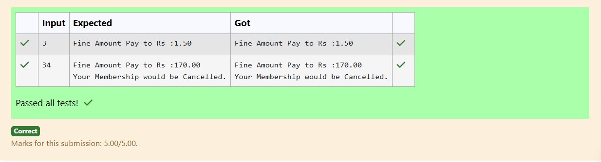

# Ex.No:1(B) CONDITIONAL STATEMENT

## QUESTION:

A library charges a fine for every book returned late. For first 5 days the fine is 50 paise, for 6-10 days fine is one rupee and above 10 days fine is 5 rupees. If you return the book after 30 days your membership will be cancelled - Print ("Your Membership would be Cancelled.")

Write a program to accept the number of days the member is late to return the book and display the fine or the appropriate message

## AIM:

To calculate and display the library fine based on the number of days a book is returned late.

## ALGORITHM :

1. Read the number of days the book is returned late.
2. Check if the days exceed 30; if yes, print the membership cancellation message.
3. If days are 1 to 5, calculate fine as 0.50 rupees per day.
4. If days are 6 to 10, calculate fine as 1 rupee per day.
5. If days are above 10, calculate fine as 5 rupees per day and display the result.

## PROGRAM:

```

import java.util.*;

public class LibraryFine {
    public static void main(String[] args) {
        Scanner sc = new Scanner(System.in);
        int days = sc.nextInt();

        if (days > 30) {
            System.out.printf("Fine Amount Pay to Rs :%.2f\n", days * 5.0);
            System.out.println("Your Membership would be Cancelled.");
        } else if (days <= 5) {
            System.out.printf("Fine Amount Pay to Rs :%.2f", days * 0.50);
        } else if (days <= 10) {
            System.out.printf("Fine Amount Pay to Rs :%.2f", days * 1.0);
        } else {
            System.out.printf("Fine Amount Pay to Rs :%.2f", days * 5.0);
        }
    }
}

```

## OUTPUT:



## RESULT:

The program displays the correct fine amount or membership cancellation message based on the delay.
