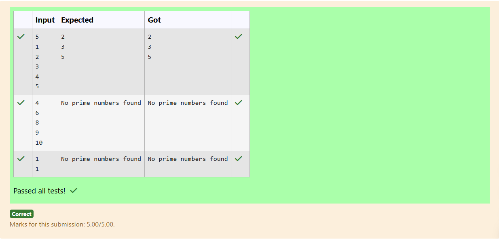

# Ex.No:1(D) ARRAYS

## QUESTION:

Write a Java program to print all prime numbers present in an array

## AIM:

To find and print all prime numbers present in a given array.

## ALGORITHM :

1. Read the size of the array and the array elements.
2. For each number in the array, check if it is greater than 1.
3. For each valid number, check divisibility from 2 to sqrt(number).
4. If the number has no divisors, consider it prime and print it.
5. Continue until all array elements are checked.

## PROGRAM:

```

import java.util.Scanner;

public class PrimeNumbersInArray {
    public static void main(String[] args) {
        Scanner sc = new Scanner(System.in);

        // Input size of array
        int n = sc.nextInt();
        int arr[] = new int[n];

        // Input array elements
        for (int i = 0; i < n; i++) {
            arr[i] = sc.nextInt();
        }

        boolean foundPrime = false;

        // Check each element for primality
        for (int i = 0; i < n; i++) {
            if (isPrime(arr[i])) {
                System.out.println(arr[i]);
                foundPrime = true;
            }
        }

        if (!foundPrime) {
            System.out.println("No prime numbers found");
        }

        sc.close();
    }

    // Function to check if a number is prime
    public static boolean isPrime(int num) {
        if (num <= 1) {
            return false;  // 0, 1 and negative numbers are not prime
        }
        if (num == 2) {
            return true;   // 2 is prime
        }
        if (num % 2 == 0) {
            return false;  // even numbers > 2 are not prime
        }
        for (int i = 3; i <= Math.sqrt(num); i += 2) {
            if (num % i == 0) {
                return false;
            }
        }
        return true;
    }
}

```

## OUTPUT:



## RESULT:

The program identifies and prints all prime numbers from the given array.
