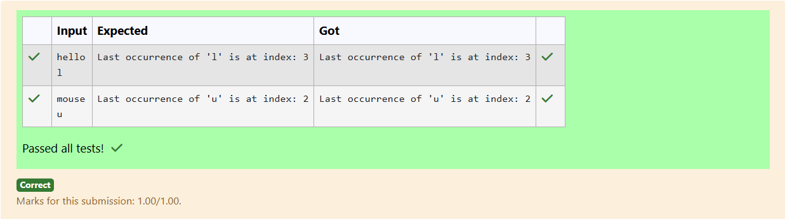

# Ex.No:1(E) STRINGS AND MATH FUNCTION

## QUESTION:

Write a java program to find the index of the last occurrence of a character in a string.

## AIM:

To find and print the index of the last occurrence of a given character in a string.

## ALGORITHM :

1. Read a string and a character from the user.
2. Initialize a variable to store the last index (e.g., -1).
3. Traverse the string from start to end.
4. Whenever the character matches, update the last index.
5. After the loop ends, print the last index value.

## PROGRAM:

```

import java.util.*;

public class prog
{
    public static int findLastOccurrence(String str,char ch)
    {
        return str.lastIndexOf(ch);
    }
    public static void main(String[] args)
    {
        Scanner sc = new Scanner(System.in);
        String str=sc.nextLine();
        char ch=sc.next().charAt(0);
        int index=findLastOccurrence(str,ch);
        
        if(index!=-1)
        {
            System.out.println("Last occurrence of '"+ch+"' is at index: "+index);
        }
        else
        {
            System.out.println("Character"+ch+"not found in the string.");
        }
    }
}

```

## OUTPUT:



## RESULT:

The program outputs the index of the last occurrence of the specified character in the string.
