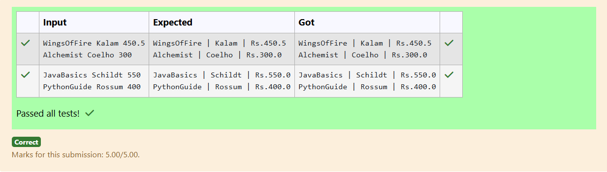

# Ex.No:2(A) CLASS AND OBJECT

## QUESTION:

Create a class Book with attributes title, author, price. Create 2 objects and print their details.

## AIM:

To create a Book class with title, author, and price, then create two objects and display their details.

## ALGORITHM :

1. Define a Book class with attributes title, author, and price.
2. Create a constructor to initialize these attributes.
3. In the main method, create two Book objects with sample values.
4. Print the details of each Book object.
5. End the program after displaying both books’ information.

## PROGRAM:

```

import java.util.Scanner;

class Book {
    String title;
    String author;
    double price;
}

public class Main {
    public static void main(String[] args) {
        Scanner sc = new Scanner(System.in);

        Book b1 = new Book();
        b1.title = sc.next();
        b1.author = sc.next();
        b1.price = sc.nextDouble();

        Book b2 = new Book();
        b2.title = sc.next();
        b2.author = sc.next();
        b2.price = sc.nextDouble();

        System.out.println(b1.title + " | " + b1.author + " | Rs." + b1.price);
        System.out.println(b2.title + " | " + b2.author + " | Rs." + b2.price);

        sc.close();
    }
}

```

## OUTPUT:



## RESULT:

The program creates two Book objects and prints their title, author, and price.
