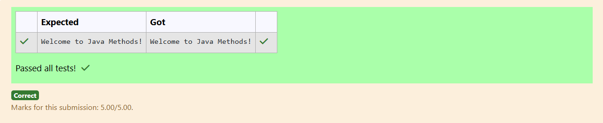

# Ex.No:2(B) METHODS

## QUESTION:

Write a method named displayMessage() that prints "Welcome to Java Methods!". Call this method from the main() method.

## AIM:

To create a method named displayMessage() that prints a welcome message and call it from the main method.

## ALGORITHM :

1. Define a method named displayMessage().
2. Inside the method, print "Welcome to Java Methods!".
3. In the main method, call the displayMessage() method.
4. Ensure the method is static so it can be called without creating an object.
5. Execute the program to display the message.

## PROGRAM:

```

public class prog {
    static void displayMessage() {
        System.out.println("Welcome to Java Methods!");
    }

    public static void main(String[] args) {
        displayMessage();
    }
}

```

## OUTPUT:



## RESULT:

The program prints the welcome message by calling the displayMessage() method from main.
