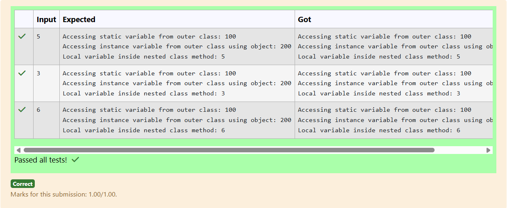

# Ex.No:2(D) VARIABLE SCOPE AND CONSTRUCTOR

## QUESTION:

Develop a class with a static nested class. 

## AIM:

Create a Java class containing a static nested class.

## ALGORITHM :

1. Create an outer class named Outer.
2. Declare a static nested class named Inner inside it.
3. Add a method in Inner to display a message.
4. In main(), call Inner’s method using Outer.Inner syntax.
5. Compile and run to verify output.

## PROGRAM:

```

import java.util.Scanner;

class prog {
    static int staticVar = 100;
    int instanceVar = 200;

    static class Nested {
        void display(int n) {
            System.out.println("Accessing static variable from outer class: " + prog.staticVar);
            
            // To access instance variable of Outer, create an object
            prog obj = new prog();
            System.out.println("Accessing instance variable from outer class using object: " + obj.instanceVar);
            
            System.out.println("Local variable inside nested class method: " + n);
        }
    }

    public static void main(String[] args) {
        Scanner sc = new Scanner(System.in);
        int n = sc.nextInt();
        
        prog.Nested nestedObj = new prog.Nested();
        nestedObj.display(n);
        sc.close();
    }
}

```

## OUTPUT:



## RESULT:

Static nested class implemented and accessed successfully.
