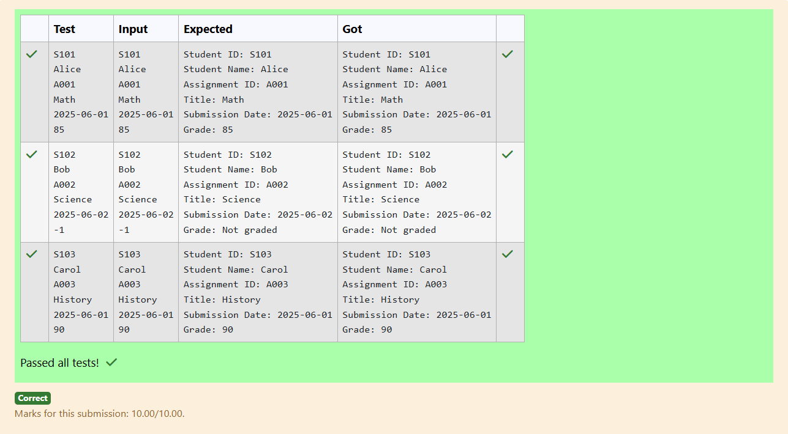

# Ex.No:3(A) INHERITANCE AND AGGREGATION

## QUESTION:

You need to design a system to manage student assignments.

Super Class: Student with

studentId

studentName

Sub class: Assignment

assignmentId

title

submissionDate (String for simplicity)

grade (int, -1 if not graded yet)

The system should accept 4 inputs representing students and their assignments, then display their details including grade or "Not graded" if grade == -1.

Input Format:

S101

Alice

A001

Math

2025-06-01

85

 

Output:

Student ID: S101
Student Name: Alice
Assignment ID: A001
Title: Math
Submission Date: 2025-06-01
Grade: 85

## AIM:

Design a Student–Assignment system using inheritance and display assignment details with grade or "Not graded".

## ALGORITHM :

1. Create a superclass Student with studentId and studentName.
2. Create a subclass Assignment extending Student with assignmentId, title, submissionDate, and grade.
3. Read all inputs (student + assignment details).
4. Display all fields; if grade == -1, print "Not graded".
5. Print formatted student and assignment details as output.

## PROGRAM:

```

import java.util.*;

class Student {
    String studentId;
    String studentName;

    Student(String studentId, String studentName) {
        this.studentId = studentId;
        this.studentName = studentName;
    }

    void display() {
        System.out.println("Student ID: " + studentId);
        System.out.println("Student Name: " + studentName);
    }
}

class Assignment extends Student {
    String assignmentId;
    String title;
    String submissionDate;
    int grade;

    Assignment(String studentId, String studentName, String assignmentId, String title, String submissionDate, int grade) {
        super(studentId, studentName);
        this.assignmentId = assignmentId;
        this.title = title;
        this.submissionDate = submissionDate;
        this.grade = grade;
    }

    @Override
    void display() {
        super.display();
        System.out.println("Assignment ID: " + assignmentId);
        System.out.println("Title: " + title);
        System.out.println("Submission Date: " + submissionDate);
        if (grade == -1)
            System.out.println("Grade: Not graded");
        else
            System.out.println("Grade: " + grade);
    }
}

public class prog {
    public static void main(String[] args) {
        Scanner sc = new Scanner(System.in);

        
            String sid = sc.nextLine();
            String sname = sc.nextLine();
            String aid = sc.nextLine();
            String title = sc.nextLine();
            String date = sc.nextLine();
            int grade = Integer.parseInt(sc.nextLine());

            Assignment a = new Assignment(sid, sname, aid, title, date, grade);
            a.display();
        
        sc.close();
    }
}

```

## OUTPUT:



## RESULT:

Student–Assignment details displayed successfully with correct grade handling.
