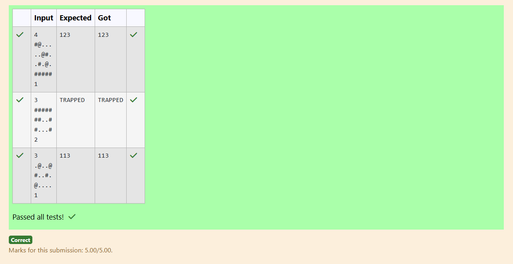

# Ex.No:3(C) ABSTRACTION

## QUESTION:

In a secret facility, you are designing intelligent agents that can explore grid-based mazes. Each agent sees the maze differently and interprets it using their unique instinct.

You are to build a system using abstraction where a base class MazeAgent declares an abstract method:

abstract String generateNavigationCode(String[] maze);
Two agents – ScoutAgent and HunterAgent – extend this class, but behave very differently.

Agent Behaviors
ScoutAgent
This agent is highly sensitive to special signals placed in the maze. Every time it senses the signal (@), it records where (which corridor row) the signal was found.
The final navigation code is the sequence of all those rows where it felt the signal — encoded as numbers.

HunterAgent
This agent is on the lookout for how trapped it might be. It keeps a strict count of all obstructions it sees in the maze walls.
If the number of such obstructions is equal or more than 10, it believes it's been trapped. Otherwise, it considers itself safe to escape.

🛠️ Your Task:
Implement the abstract class and its derived classes.

Accept maze rows as input.

Create the agent based on input.

Print the navigation code they generate.

Input Format:
n
maze_row_1
maze_row_2
...
maze_row_n
type
n = number of rows in the maze

Each maze_row_i = a string containing symbols (like #, ., @)

type = 1 for ScoutAgent, 2 for HunterAgent

Output Format:
A string representing the navigation code as computed by the selected agent. -

For HunterAgent - "TRAPPED"/ "ESCAPE"

## AIM:

To implement abstraction using an abstract class MazeAgent with an abstract method generateNavigationCode(), and create ScoutAgent and HunterAgent with different maze-processing behaviors.

## ALGORITHM :

1. Create an abstract class MazeAgent with an abstract method generateNavigationCode(String[] maze).
2. Implement ScoutAgent to scan each row for '@' and record the row numbers where it appears.
3. Implement HunterAgent to count the number of '#' symbols and decide ESCAPE or TRAPPED based on the count.
4. Read input: number of rows, the maze rows, and the agent type (1 or 2).
5. Create the corresponding agent object, call generateNavigationCode(), and print the result.

## PROGRAM:

```

import java.util.*;

abstract class MazeAgent {
    abstract String generateNavigationCode(String[] maze);
}

class ScoutAgent extends MazeAgent {
    public String generateNavigationCode(String[] maze) {
        StringBuilder code = new StringBuilder();
        for (int i = 0; i < maze.length; i++) {
            if (maze[i].contains("@")) {
                for (char ch : maze[i].toCharArray()) {
                    if (ch == '@') {
                        code.append(i + 1); // row number, 1-based
                    }
                }
            }
        }
        return code.toString();
    }
}

class HunterAgent extends MazeAgent {
    public String generateNavigationCode(String[] maze) {
        int wallCount = 0;
        for (String row : maze) {
            for (char ch : row.toCharArray()) {
                if (ch == '#') wallCount++;
            }
        }
        return wallCount >= 10 ? "TRAPPED" : "ESCAPE";
    }
}

public class prog {
    public static void main(String[] args) {
        Scanner sc = new Scanner(System.in);
        int n = sc.nextInt(); sc.nextLine(); // number of rows
        String[] maze = new String[n];
        for (int i = 0; i < n; i++) {
            maze[i] = sc.nextLine();
        }
        int type = sc.nextInt(); // 1 = ScoutAgent, 2 = HunterAgent

        MazeAgent agent = (type == 1) ? new ScoutAgent() : new HunterAgent();
        System.out.println(agent.generateNavigationCode(maze));
    }
}

```

## OUTPUT:



## RESULT:

The program outputs a navigation code for ScoutAgent or a TRAPPED/ESCAPE verdict for HunterAgent based on maze analysis.
