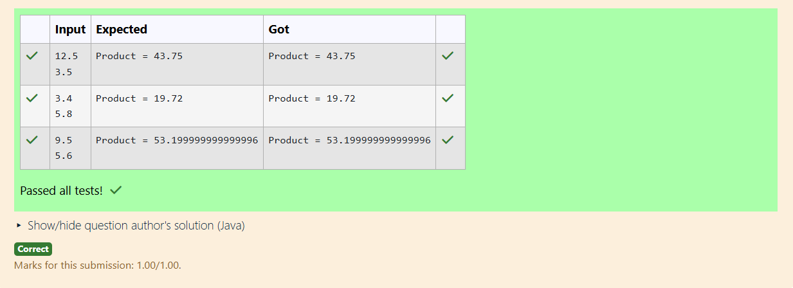

# Ex.No:3(E) INNER CLASS

## QUESTION:

Convert a string to a double using Double.parseDouble() and multiply two numbers.

## AIM:

To convert string values into double values using Double.parseDouble() and multiply the two numbers.

## ALGORITHM :

1. Read two strings from the user.
2. Convert each string into a double using Double.parseDouble().
3. Multiply the two double values.
4. Store the result in a variable.
5. Print the final multiplied value.

## PROGRAM:

```

import java.util.*;

public class Main {
    public static void main(String[] args) {
        Scanner sc = new Scanner(System.in);
        String s1 = sc.next();
        String s2 = sc.next();

        double n1 = Double.parseDouble(s1);
        double n2 = Double.parseDouble(s2);

        System.out.println("Product = " + (n1 * n2));
    }
}

```
 
## OUTPUT:



## RESULT:

The program converts two string numbers into doubles and prints their multiplication result.
