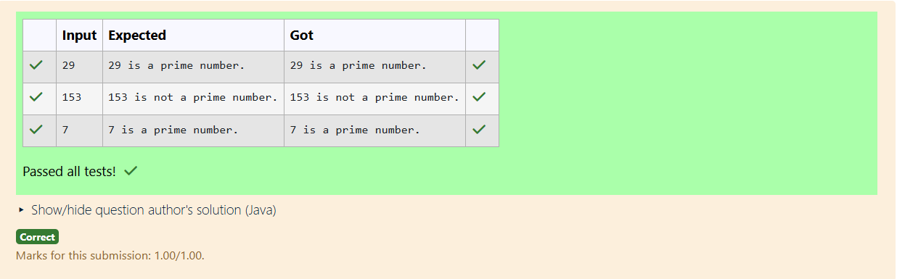

# Ex.No:3(F) WRAPPER CLASS

## QUESTION:

Write a Java program to check if a number is prime using wrapper classes. 

## AIM:

To check whether a given number is prime by using Java wrapper classes (Integer).

## ALGORITHM :

1. Read a number as a string and convert it into an Integer object using Integer.parseInt().
2. Retrieve the int value from the Integer object.
3. If the number is less than or equal to 1, declare it as not prime.
4. Check divisibility from 2 to sqrt(number).
5. If no divisors are found, print prime; otherwise, print not prime.

## PROGRAM:

```

import java.util.*;

public class Main {
    public static void main(String[] args) {
        Scanner sc = new Scanner(System.in);
        Integer num = sc.nextInt();
        boolean isPrime = true;

        if (num <= 1) isPrime = false;
        else {
            for (int i = 2; i <= Math.sqrt(num); i++) {
                if (num % i == 0) {
                    isPrime = false;
                    break;
                }
            }
        }

        if (isPrime)
            System.out.println(num + " is a prime number.");
        else
            System.out.println(num + " is not a prime number.");
    }
}

```

## OUTPUT:



## RESULT:

The program determines whether the given number (wrapped in Integer) is prime or not.
