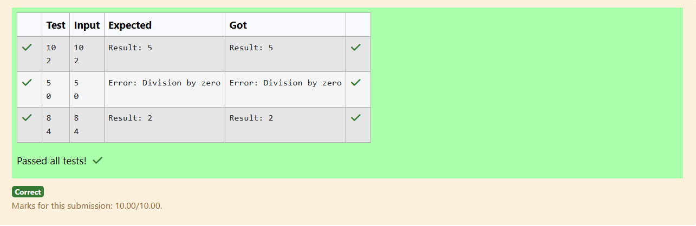

# Ex.No:4(A) EXCEPTION HANDLING

## QUESTION:

Write a program that reads two integers and divides the first by the second. Handle the case when division by zero occurs.

## AIM:

To divide two integers and handle division-by-zero using exception handling.

## ALGORITHM :

1. Read two integers from the user.
2. Use a try block to perform the division.
3. If the second integer is zero, a division-by-zero exception occurs.
4. Catch the ArithmeticException and print an appropriate message.
5. If no exception occurs, print the division result.

## PROGRAM:

```

import java.util.Scanner;

public class Main {
    public static void main(String[] args) {
        Scanner sc = new Scanner(System.in);

        // --- Part 1: Division with exception handling ---
        try {
            int a = sc.nextInt();
            int b = sc.nextInt();

            try {
                int result = a / b;
                System.out.println("Result: " + result);
            } catch (ArithmeticException e) {
                System.out.println("Error: Division by zero");
            }

        } catch (Exception e) {
            System.out.println("Invalid input");
            sc.close();
            return; 
        }

        

        sc.close();
    }
}

```

## OUTPUT:



## RESULT:

The program divides two integers and safely handles division-by-zero errors.
