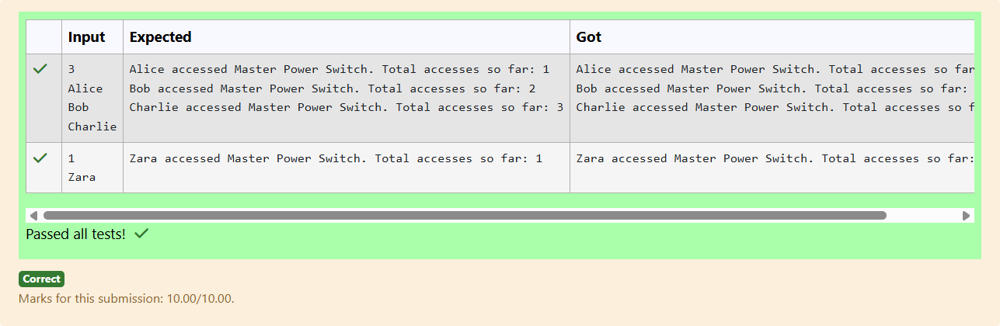

# Ex.No:4(B)  IMPLEMENT SOLID PRINCIPLES IN JAVA PROGRAM 

## QUESTION:

In a gaming lounge, there is only one master console power switch that controls all gaming consoles. Whenever a player turns on any console, it internally triggers the master power. The master switch must ensure only one instance is ever created, regardless of how many times it's accessed, to prevent power fluctuations.

Every time a player accesses the master switch, it logs an access count. Since the switch is Singleton, the count should increment globally and reflect shared state.

Input Format:

n
[Player1]
[Player2]
...
First line: Integer n – number of players turning on consoles

Next n lines: Each line contains the player's name.

 

Output Format:
For each player, print:

[PlayerName] accessed Master Power Switch. Total accesses so far: [count]

## AIM:

To implement a Singleton class that tracks the total number of times players access the master power switch, ensuring only one shared instance exists.

## ALGORITHM :

1. Create a Singleton class MasterSwitch with a private static instance and a private access counter.
2. Provide a public getInstance() method that returns the same instance every time.
3. Each time getInstance() is called, increment the access counter.
4. Read the number of players and their names as input.
5. For each player, access the MasterSwitch instance and print the global access count.

## PROGRAM:

```

import java.util.*;

class MasterPowerSwitch {
    private static MasterPowerSwitch instance = null;
    private int accessCount = 0;

    // private constructor to prevent creation
    private MasterPowerSwitch() {}

    // static method to return the single instance
    public static MasterPowerSwitch getInstance() {
        if (instance == null) {
            instance = new MasterPowerSwitch();
        }
        return instance;
    }

    // method to log access and increment the global count
    public int logAccess() {
        accessCount++;
        return accessCount;
    }
}

public class prog {
    public static void main(String[] args) {
        Scanner sc = new Scanner(System.in);
        int n = sc.nextInt();
        sc.nextLine();

        for (int i = 0; i < n; i++) {
            String player = sc.nextLine();
            MasterPowerSwitch power = MasterPowerSwitch.getInstance();
            int count = power.logAccess();
            System.out.println(player + " accessed Master Power Switch. Total accesses so far: " + count);
        }

        sc.close();
    }
}

```

## OUTPUT:



## RESULT:

The program ensures only one master switch exists and shows increasing global access count for each player.
