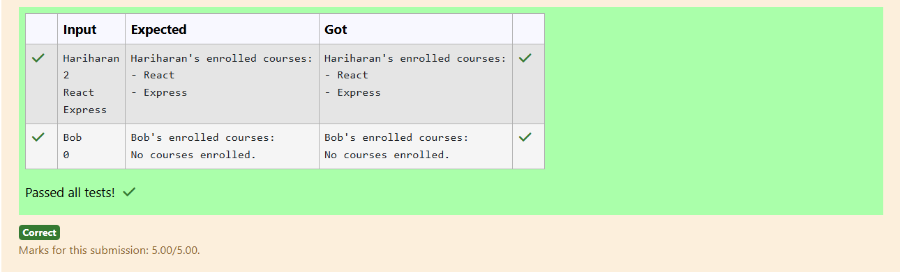

# Ex.No:4(C)  COMPOSITION IN JAVA

## QUESTION:

A student can enroll in multiple courses. The relationship is many-to-many via association.
If No Courses were assigned, print "No courses enrolled." 

## AIM:

To implement a many-to-many association where a student can enroll in multiple courses, and display the enrolled courses or a message if none are assigned.

## ALGORITHM :

1. Create a Course class to represent each course.
2. Create a Student class containing a list of Course objects.
3. Provide a method to enroll (add) courses to the student.
4. If the student has no courses, print "No courses enrolled."
5. Otherwise, print the names of all enrolled courses.

## PROGRAM:

```

import java.util.*;

public class AssociationExample {
    public static void main(String[] args) {
        Scanner sc = new Scanner(System.in);
        String studentName = sc.nextLine();
        Student student = new Student(studentName);

        int n = sc.nextInt();
        sc.nextLine();

        for (int i = 0; i < n; i++) {
            String course = sc.nextLine();
            student.enroll(new Course(course));
        }

        student.showCourses();
        sc.close();
    }
}

class Course {
    private String name;

    public Course(String name) {
        this.name = name;
    }

    public String getCourseName() {
        return name;
    }
}

class Student {
    private String name;
    private List<Course> courses = new ArrayList<>();

    public Student(String name) {
        this.name = name;
    }

    public void enroll(Course c) {
        courses.add(c);
    }

    public void showCourses() {
        System.out.println(name + "'s enrolled courses:");
        if (courses.isEmpty()) {
            System.out.println("No courses enrolled.");
            return;
        }

        for (Course c : courses) {
            System.out.println("- " + c.getCourseName());
        }
    }
}

```

## OUTPUT:



## RESULT:

The program displays all courses a student is enrolled in or prints a message if no courses are assigned.
