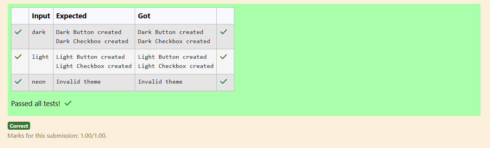

# Ex.No:4(D) DESIGN PATTERN -- ABSTRACT FACTORY

## QUESTION:

You’re creating a cross-platform UI tool using the Abstract Factory pattern. Implement factories to create Button and Checkbox for "dark" and "light" themes. Let the user choose the theme, then generate UI components and display their types

## AIM:

To implement the Abstract Factory Pattern for creating Button and Checkbox UI components for Dark and Light themes, and display the component types based on user-selected theme.

## ALGORITHM :

1. Create abstract products Button and Checkbox, and concrete implementations for Dark and Light themes.
2. Create an abstract factory UIComponentFactory with methods to create Button and Checkbox.
3. Implement DarkThemeFactory and LightThemeFactory to produce theme-specific components.
4. Read the user’s theme choice and create the corresponding factory.
5. Use the factory to generate Button and Checkbox objects and display their types.

## PROGRAM:

```

import java.util.Scanner;

interface Button {
    void render();
}

interface Checkbox {
    void render();
}

// -------- Dark Theme Components --------
class DarkButton implements Button {
    public void render() {
        System.out.println("Dark Button created");
    }
}

class DarkCheckbox implements Checkbox {
    public void render() {
        System.out.println("Dark Checkbox created");
    }
}

// -------- Light Theme Components --------
class LightButton implements Button {
    public void render() {
        System.out.println("Light Button created");
    }
}

class LightCheckbox implements Checkbox {
    public void render() {
        System.out.println("Light Checkbox created");
    }
}

// -------- Abstract Factory --------
interface UIFactory {
    Button createButton();
    Checkbox createCheckbox();
}

// -------- Dark Theme Factory --------
class DarkThemeFactory implements UIFactory {
    public Button createButton() {
        return new DarkButton();
    }

    public Checkbox createCheckbox() {
        return new DarkCheckbox();
    }
}

// -------- Light Theme Factory --------
class LightThemeFactory implements UIFactory {
    public Button createButton() {
        return new LightButton();
    }

    public Checkbox createCheckbox() {
        return new LightCheckbox();
    }
}

// -------- Main Class --------
public class Main {
    public static void main(String[] args) {
        Scanner scanner = new Scanner(System.in);
        String theme = scanner.nextLine().trim().toLowerCase();

        UIFactory factory;

        if (theme.equals("dark")) {
            factory = new DarkThemeFactory();
        } else if (theme.equals("light")) {
            factory = new LightThemeFactory();
        } else {
            System.out.println("Invalid theme");
            scanner.close();
            return;
        }

        factory.createButton().render();
        factory.createCheckbox().render();

        scanner.close();
    }
}

```

## OUTPUT:



## RESULT:

The system creates and displays theme-specific UI components using the Abstract Factory pattern.
