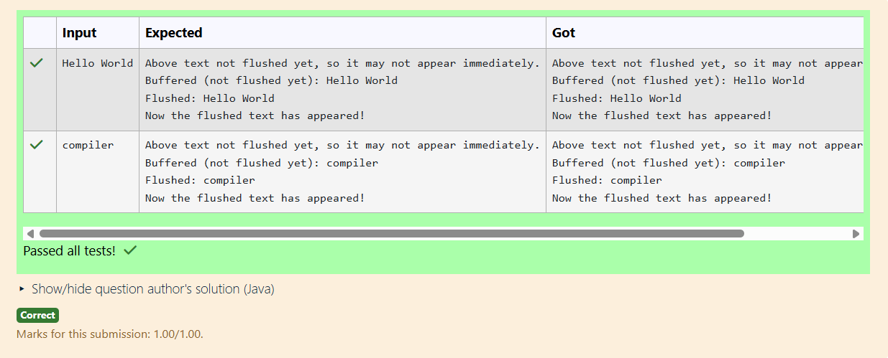

# Ex.No:5(A) INPUTSTREAMREADER 

## QUESTION:

Write a program to demonstrate flushing behavior of BufferedWriter.

## AIM:

To demonstrate how BufferedWriter flushes data to a file using the flush() method.

## ALGORITHM :

1. Create a FileWriter and wrap it with BufferedWriter.
2. Write some text using write() but do not close the stream yet.
3. Call flush() to force writing buffered data to the file.
4. Continue writing more text and flush again.
5. Close the writer and verify the content is written immediately after each flush.

## PROGRAM:

```

import java.io.BufferedWriter;
import java.io.IOException;
import java.io.OutputStreamWriter;
import java.util.Scanner;

public class BufferedWriterFlushUserInput {
    public static void main(String[] args) {
        Scanner sc = new Scanner(System.in);

        // write your code here
        try {
            String text = sc.nextLine();

            BufferedWriter bw = new BufferedWriter(new OutputStreamWriter(System.out));
            System.out.println("Above text not flushed yet, so it may not appear immediately.");

            bw.write("Buffered (not flushed yet): " + text);
            bw.newLine();

            bw.write("Flushed: " + text);
            bw.flush();   // now text is actually sent to output
            bw.newLine();
            System.out.println("\nNow the flushed text has appeared!");

            bw.close();
        } catch (IOException e) {
            e.printStackTrace();
        }

        sc.close();
    }
}

```

## OUTPUT:



## RESULT:

The program shows that flush() forces BufferedWriter to write data to the file instantly without waiting for the buffer to fill.
