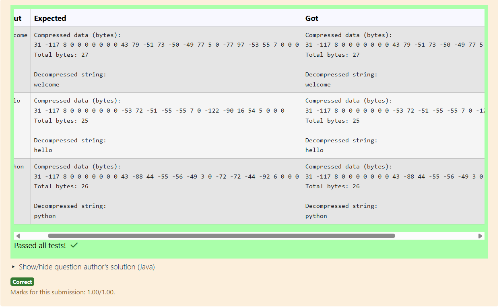

# Ex.No:5(B) SERIALIZATION AND DESERIALIZATION 

## QUESTION:

To read a string, compress it using ByteArrayOutputStream and GZIPOutputStream, and decompress it back using ByteArrayInputStream and GZIPInputStream in Java.

## AIM:

To read a string, compress it using ByteArrayOutputStream and GZIPOutputStream, and decompress it back using ByteArrayInputStream and GZIPInputStream in Java.

## ALGORITHM :

1. Read a string from the user.
2. Create a ByteArrayOutputStream and wrap it with GZIPOutputStream to compress the string.
3. Convert the compressed bytes into a ByteArrayInputStream.
4. Wrap the input stream with GZIPInputStream to decompress the data.
5. Read the decompressed result and print the original string back.

## PROGRAM:

```

import java.io.ByteArrayInputStream;
import java.io.ByteArrayOutputStream;
import java.io.IOException;
import java.util.Scanner;
import java.util.zip.GZIPInputStream;
import java.util.zip.GZIPOutputStream;

public class GzipCompressDecompress {
    public static void main(String[] args) {
        Scanner sc = new Scanner(System.in);
        String input = sc.nextLine();
        sc.close();

        try {
            // Compress
            byte[] inputBytes = input.getBytes("UTF-8");
            ByteArrayOutputStream baos = new ByteArrayOutputStream();
            try (GZIPOutputStream gzos = new GZIPOutputStream(baos)) {
                gzos.write(inputBytes);
                // closing/finishing the GZIPOutputStream flushes compressed data to baos
            }
            byte[] compressed = baos.toByteArray();

            // Print compressed bytes (signed byte values)
            System.out.println("Compressed data (bytes):");
            for (byte b : compressed) {
                System.out.print(b + " ");
            }
            System.out.println();
            System.out.println("Total bytes: " + compressed.length);
            System.out.println();

            // Decompress
            ByteArrayInputStream bais = new ByteArrayInputStream(compressed);
            ByteArrayOutputStream decompressedBaos = new ByteArrayOutputStream();
            try (GZIPInputStream gzis = new GZIPInputStream(bais)) {
                byte[] buffer = new byte[1024];
                int read;
                while ((read = gzis.read(buffer)) != -1) {
                    decompressedBaos.write(buffer, 0, read);
                }
            }
            String decompressed = decompressedBaos.toString("UTF-8");

            System.out.println("Decompressed string:");
            System.out.println(decompressed);

        } catch (IOException e) {
            System.err.println("I/O error while compressing/decompressing: " + e.getMessage());
            e.printStackTrace();
        }
    }
}

```

## OUTPUT:



## RESULT:

The program compresses a string in memory using GZIP and successfully decompresses it back to the original text.
