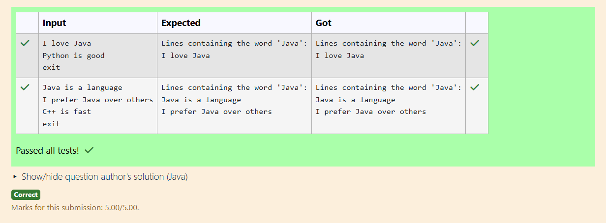

# Ex.No:5(C)  FILE HANDLING USING JAVA
## QUESTION:

Read a file and print only the lines containing the word "Java".

## AIM:

To read a file line by line and print only those lines that contain the word "Java".

## ALGORITHM :

1. Open the file using FileReader and BufferedReader.
2. Read each line inside a loop.
3. Check if the line contains the word "Java".
4. If the condition is true, print the line.
5. Close the reader after processing all lines.

## PROGRAM:

```

import java.util.*;

public class Main {
    public static void main(String[] args) {
        Scanner sc = new Scanner(System.in);
        ArrayList<String> lines = new ArrayList<>();


        while (true) {
            String line = sc.nextLine();
            if (line.equals("exit")) {
                break;
            }
            lines.add(line);
        }

        System.out.println("Lines containing the word 'Java':");
        for (String line : lines) {
            if (line.contains("Java")) {
                System.out.println(line);
            }
        }
    }
}

```

## OUTPUT:



## RESULT:

The program prints only the lines from the file that contain the word "Java".
