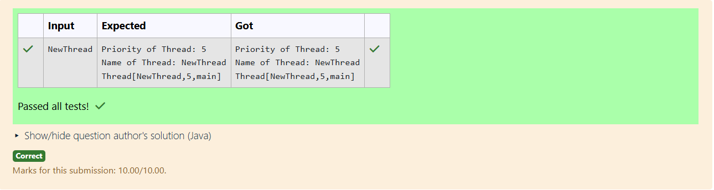

# Ex.No:5(D) THREAD PRIORITY

## QUESTION:

Write a java program for determine the priority and name of the current thread.
Note : Read the threadname from the User

## AIM:

To read a thread name from the user, set it to the current thread, and display the thread’s name and priority.

## ALGORITHM :

1. Read the desired thread name from the user.
2. Get the current thread using Thread.currentThread().
3. Set the thread’s name to the user-given name.
4. Retrieve the thread’s name and priority.
5. Print the thread name and priority.

## PROGRAM:

```

import java.util.Scanner;

public class ThreadInfo {
    public static void main(String[] args) {
        Scanner sc = new Scanner(System.in);

        // Read thread name from user
        String name = sc.nextLine();

        // Get current thread
        Thread t = Thread.currentThread();

        // Set the thread name
        t.setName(name);

        // Print results
        System.out.println("Priority of Thread: " + t.getPriority());
        System.out.println("Name of Thread: " + t.getName());
        System.out.println(t);
    }
}

```

## OUTPUT:



## RESULT:

The program sets the current thread’s name and displays its priority and name.
