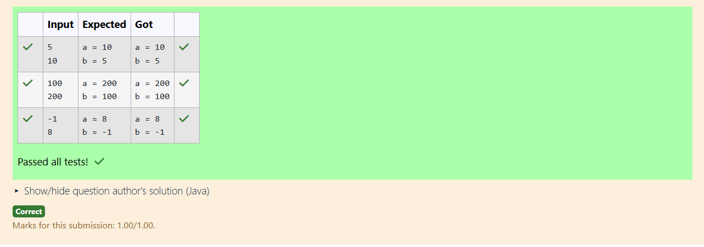

# Ex.No:5(E) MULTITHREADING -SYNCHRONIZATION

## QUESTION:

Maintain two int variables a and b, read their initial values from user. Use synchronized block to swap them and print swapped values.

Input:
Two lines: a and b values

Output:
a = <swapped_a>
b = <swapped_b>

## AIM:

To swap two integer values using a synchronized block and display the swapped results.

## ALGORITHM :

1. Read two integers a and b from the user.
2. Create an object lock for synchronization.
3. Use a synchronized block to perform the swap safely.
4. Store swapped values back into a and b.
5. Print the swapped values.

## PROGRAM:

```

import java.util.Scanner;

public class SwapUsingSync {
    public static void main(String[] args) {
        Scanner sc = new Scanner(System.in);

        // Read two integers from input (each on its own line)
        int a = sc.nextInt();
        int b = sc.nextInt();

        final Object lock = new Object(); // lock object for synchronization

        synchronized (lock) {
            int temp = a;
            a = b;
            b = temp;
        }

        System.out.println("a = " + a);
        System.out.println("b = " + b);

        sc.close();
    }
}

```

## OUTPUT:



## RESULT:

The program swaps two integers safely using a synchronized block and prints the updated values.
